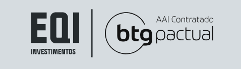
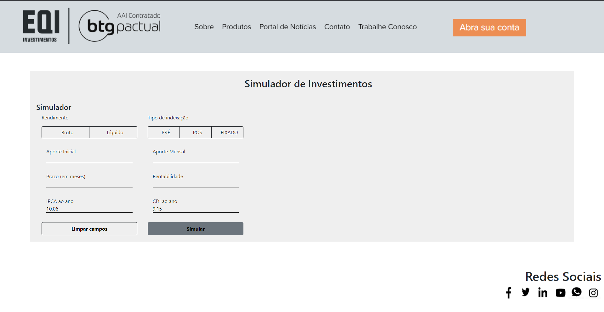
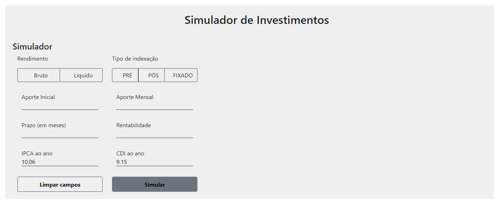
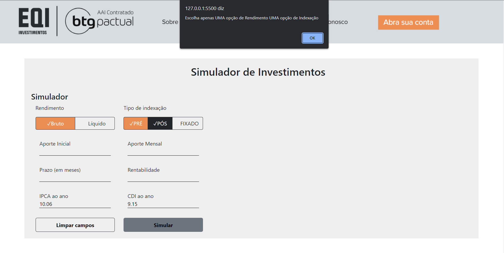
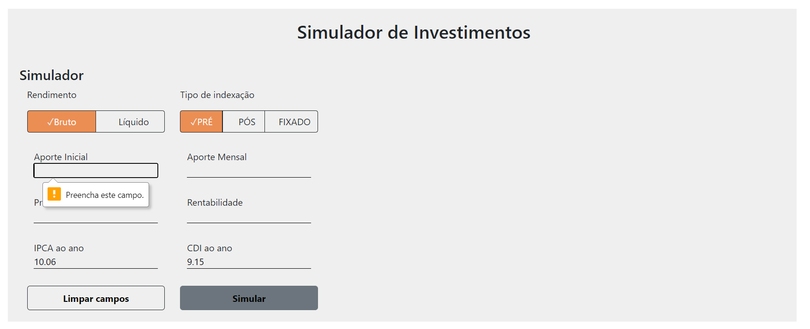
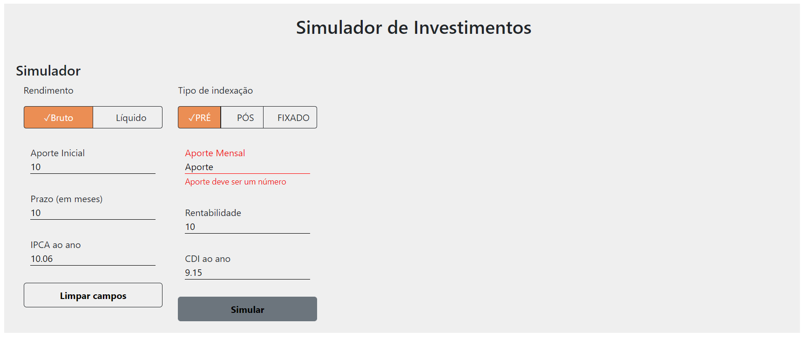
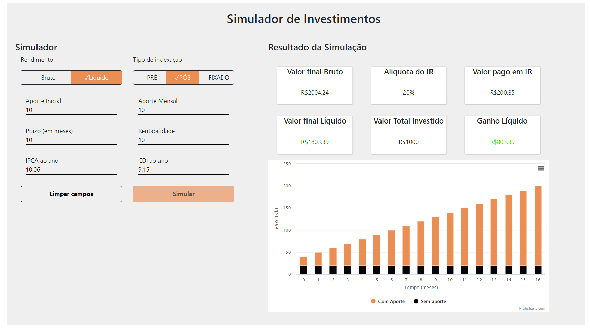
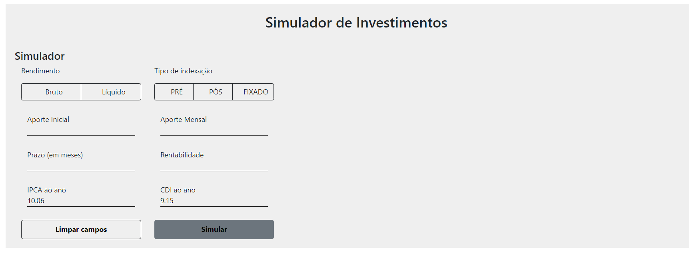
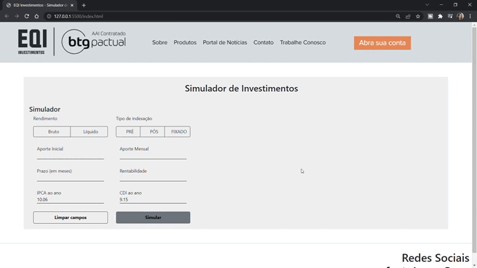
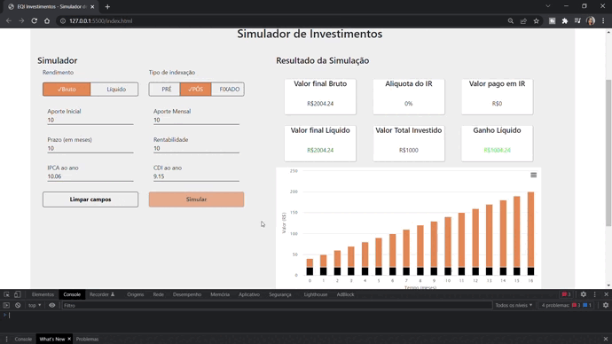

  

## 
EQI Simulador de Investimentos - Fake-API

 

 

## ✅ Visão geral

Esse é um desafio proposto pela [EQI Investimentos](https://eqi.com.br/) um dos maiores escritórios de Assessoria de Investimentos com presença em 11 cidades no Brasil e 11 anos de história no Mercado Financeiro.

 

## ✅ Objetivo

O desafio consiste em avaliar a construção do front-end de um Simulador de Investimentos a partir de uma API fake já disponilibilizada. A aplicação deverá permitir ao usuário realizar uma simulação de rendimentos de acordo com o tipo de Indexação e tipo de Rendimento escolhido. O front-end deve ser construído utilizando JavaScript puro ou React e seguindo os wireframes apresentados no [repositório](https://github.com/eqi-investimentos/desafio-frontend).

 

## ✅ Desenvolvimento

Para desenvolver essa aplicação optei utilizar o JavaScript puro pois o objetivo do projeto é entender as minhas habilidades para HTML, CSS e JS. 
Utilizei como ferramenta auxiliar o Bootstrap apanas para que a estilização dos botões da aplicação ficassem idênticas ao modelo apresentado no wireframe. Todo o restante da aplicação fiz com CSS puro também por questões de avaliação.
Para criação do gráfico utilizei a biblioteca [Highcharts](https://www.highcharts.com/), onde encontrei o gráfico mais semelhante ao apresentado no wireframe.
Esse site é completamente responsivo, conforme ilustrato no gif da sessão "Responsividade" desse readme.

 

## ✅ Demonstração do funcionamento 

 
<h3 align="center"> Apresentação e visão geral do projeto
  
</h3>
Essa é a visão ao iniciar o projeto. Como uma forma de sumilar o site da empresa criei um header (apenas ilustrativo) baseado no site e um footer com as redes sociais (todos os ícones são clicáveis e serão direcionados para as respectivas redes sociais da EQI Investimentos).

 
<h3 align="center"> Tela onde será realizada as interações
  
</h3>
Assim iniciamos a aplicação com os campos vazios, sem nenhuma interação do usuário.

 
<h3 align="center"> Selecionando tipos de de Rendimento e Indexação
  
</h3>
Só será possível selecionar dois tipos de botões (um para tipo de Rendimento e outro para Tipo de Indexação), caso não atenda os critérios será disparado um "Alert" e ao pressionar "ok" os campos voltarão ao estado inicial para fazer uma nova seleção.

 
<h3 align="center"> Campos de Input requeridos
  
</h3>
Os campos de input não poderão estar vazios, caso contrário não será possível executar a simulação.
Sendo que os inputs "IPCA ao ano" e "CDI ao ano" já iniciam inseridos na tela a partir da API.

 
<h3 align="center"> Campos inválidos
  
</h3>
Os campos só poderão ser preenchidos em formato numérico.

 
<h3 align="center">Executando a simulação
  
</h3>
Ao executar a simulação as informações serão trazidas da API e exibidas dentro dos cards. Os valores variam de acordo com as opções de indexação e rendimento escolhidos.

 
<h3 align="center">Limpar campos
  
</h3>
Ao clicar no botão "Limpar campos" todos os campos serão zerados e o usuário poderá executar uma nova simulação.

 
<h3 align="center"> Campos inválidos
  
</h3>
Os campos só poderão ser preenchidos em formato numérico.

 
<h3 align="center"> Simulação na prática
  
</h3>
Esse gif mostra como a sulução funciona na prática.

 
<h3 align="center"> Responsividade
  
</h3>
Esse site é totalmente resposivo, como pode ser visto no gif acima.
Toda a responsividade foi feita através do `Media query`.

 
## ✅ Como executar esse projeto

Faça o clone/download deste repositório, execute `npm install` e `npx json-server db.json`. A API fica localizada em `http://localhost:3000`.

Requisitos:

* NodeJS
* NPM

 

## 🛠 Tecnologias Utilizadas

  <table>
  

    <tr>
      <td ></img>
      </td>
      <td ></img>
      </td>
      <td ></img>
      </td>
       <td ></img>
      </td>
    </tr>
  

</table>

## ✅ Autora

<table>
  

    <tr>
      <td align="center"><a href="https://github.com/AgathaLima"> <b>Agatha Lima - Software Developer</b></a> <a href="https://github.com/AgathaLima">🧑‍💻</a>
      </td>
    </tr>
  

</table>

